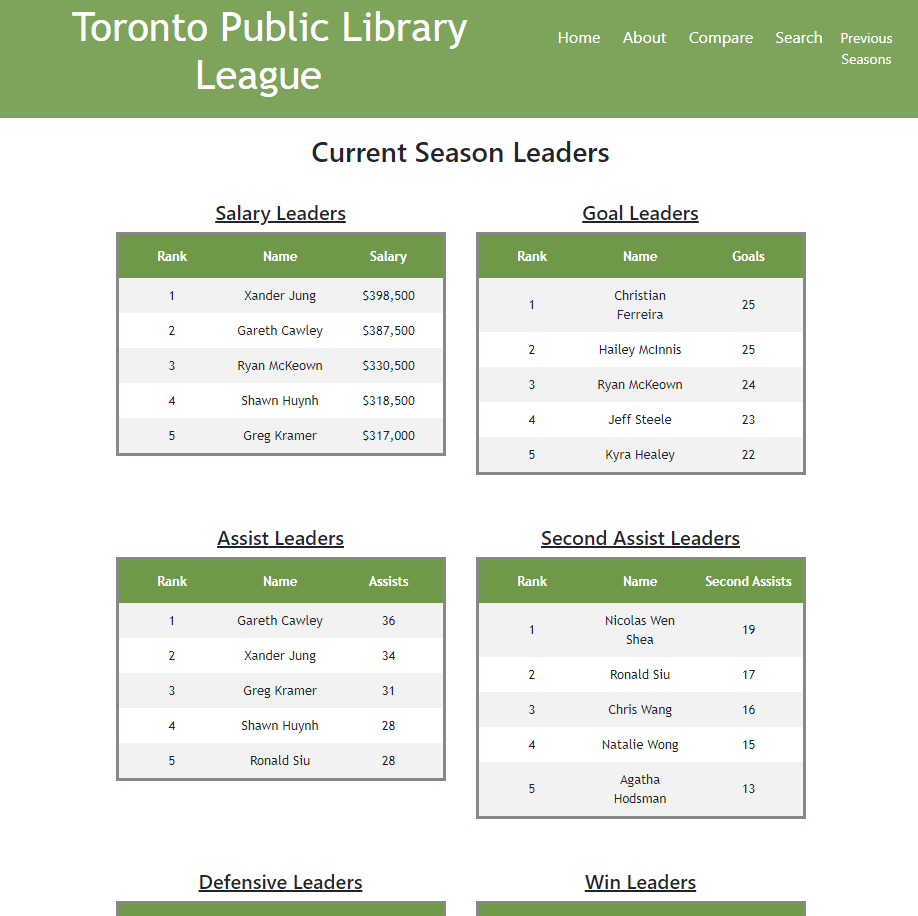

## Toronto Public Library League
Hello and welcome to the parityJS project aka the Toronto Public Library League Project.

## Tech stack
This website was built using the following JavaScript tech stack:

- JavaScript ES6
- Node.JS
- Express.JS
- Node.JS File System to mock the data
- React.JS --> from the create react app github repo [Create React App](https://github.com/facebook/create-react-appA).

## How to Run
The project is separated into a server/ and client/ folder directory.
The back end was developed using ES6 syntax. At the time of creation, the Node.JS version did not support ES6, so babel was used.

in the server directory, execute:

    $ npm run dev6

The server is hosted on localhost:1234/

in the client directory, execute:

    $ npm run start

The client is hosted on localhost:3000/

## Screeshots
