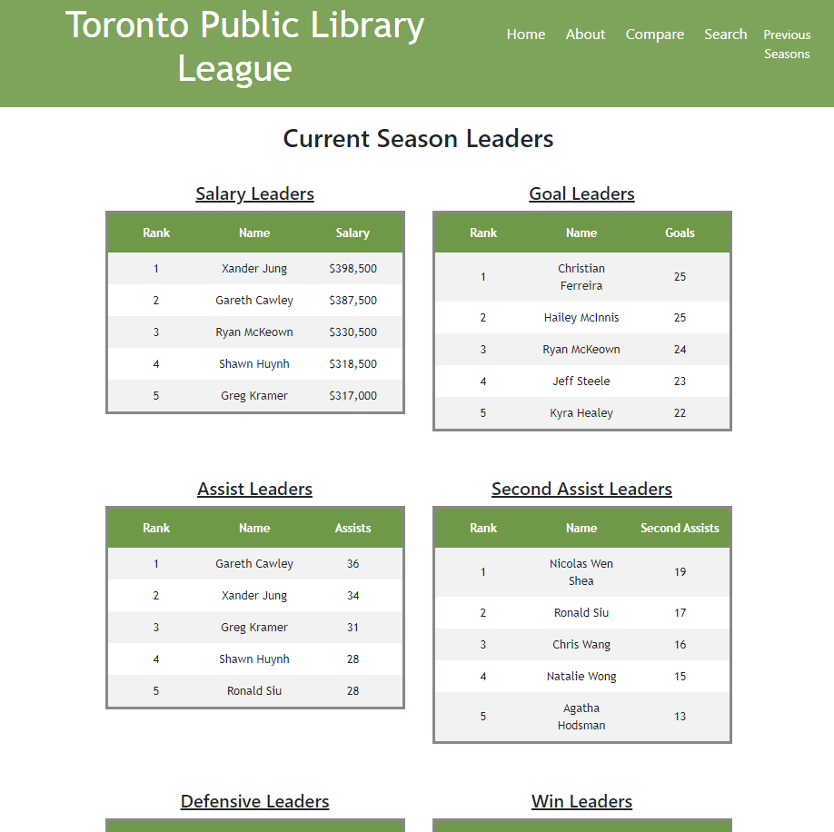
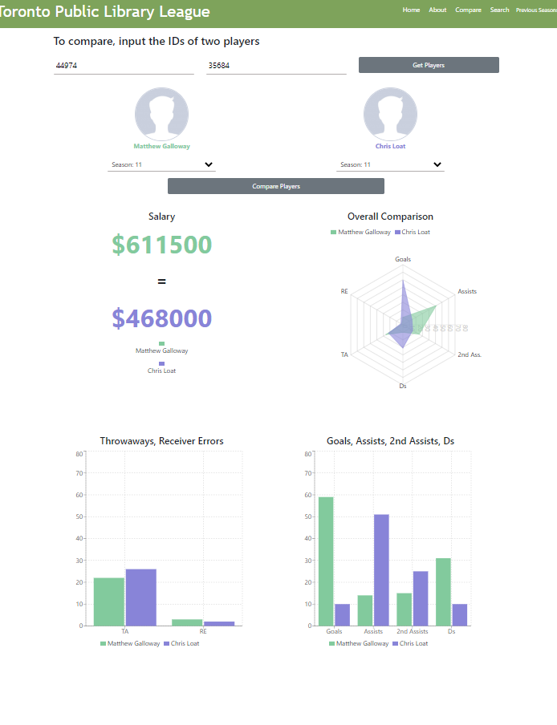
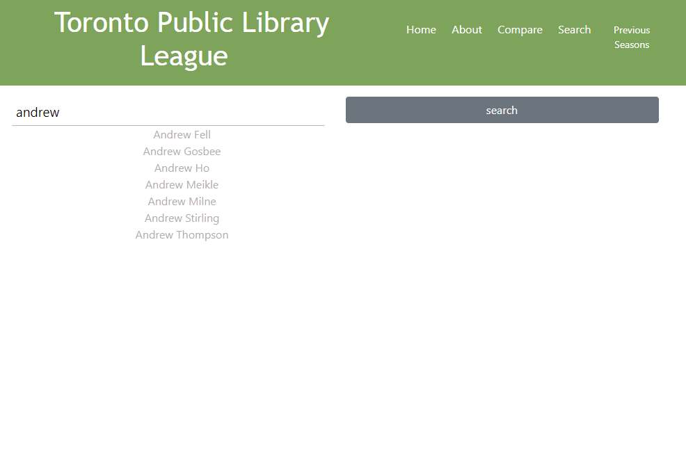
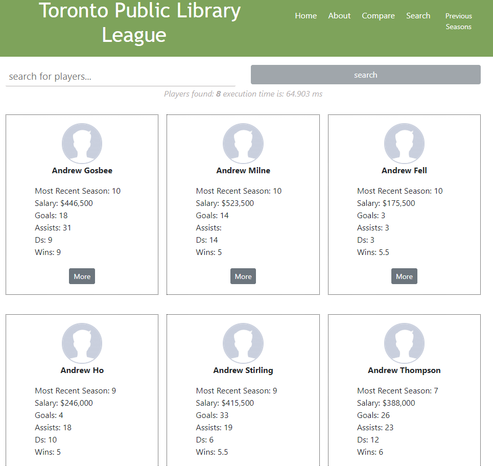
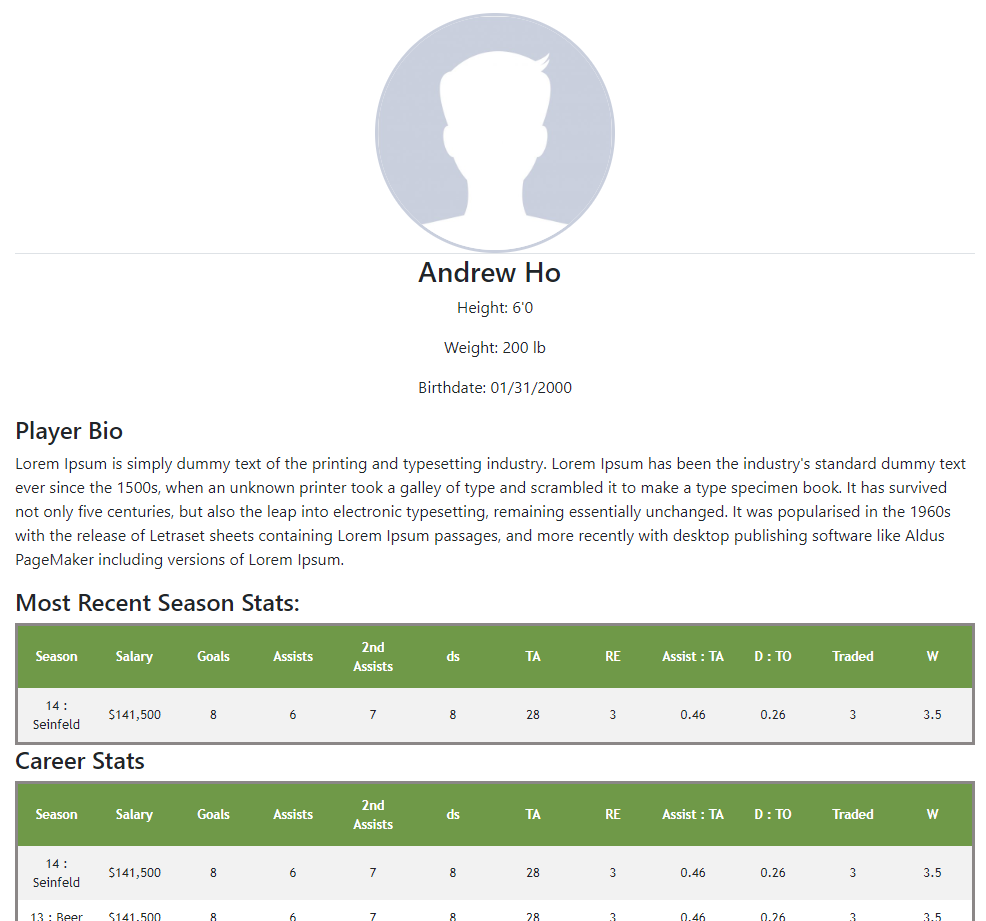
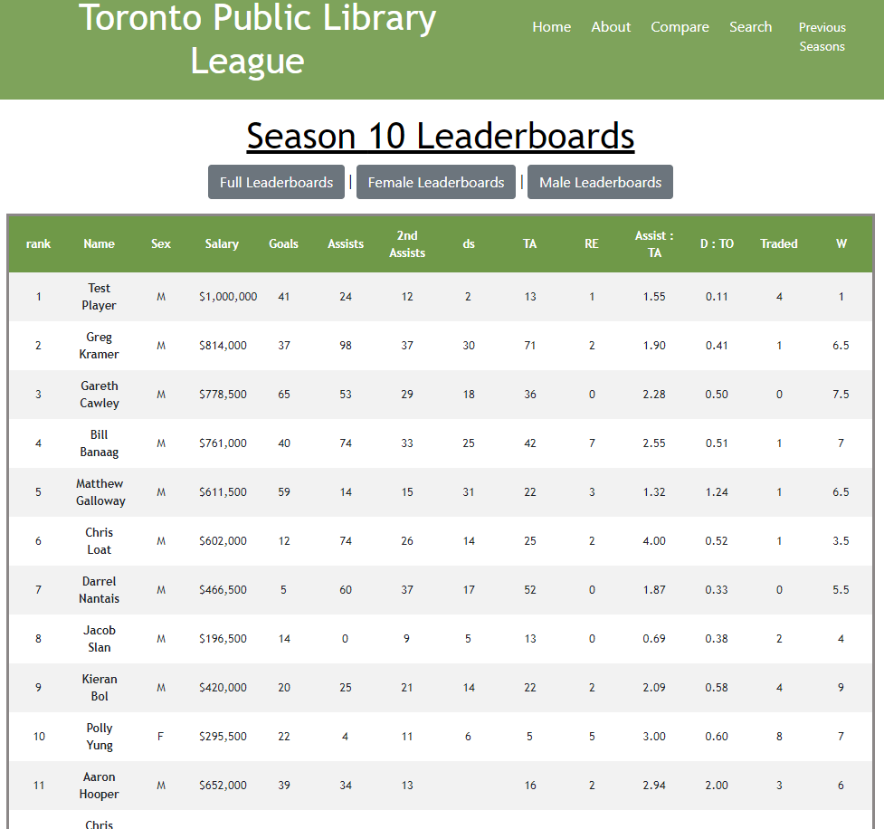

# Toronto Public Library League (TPLL)

### __Info__

Hello and welcome to the parityJS project aka the Toronto Public Library League Project. I created this project as a way to learn more about React and Node. This is for a local Frisbee league and the main features of this project show statistics, player profiles, leaderboards, and a player comparison feature of players in the league.

### __Demo__
[https://www.youtube.com/watch?v=wVXZCphzEh4](https://www.youtube.com/watch?v=wVXZCphzEh4)

### __Tech stack__

This website was built using the following JavaScript tech stack:

### __Front end__

- React 
    - [Create React App](https://github.com/facebook/create-react-appA)
    - React [ReCharts](https://github.com/recharts/recharts) to display graphs
- CSS
- HTML
- JavaScript
- Bootstrap

### __Back end__

- JavaScript ES6
- Node
- Expres

## How to Run

The project is separated into a `server/` and `client/` folder directory.
The back end was developed using ES6 syntax. At the time of creation, the Node.JS version did not support ES6, so babel was used.

in the server directory, execute:

    $ npm run dev6

The server is hosted on localhost:1234/

in the client directory, execute:

    $ npm run start

The client is hosted on localhost:3000/

### __Screenshots__

> __Home page__

> __Player Comparison__

> __Search Feature__

> __Search Results__

> __Player Profile__

> __Leaderboards__
